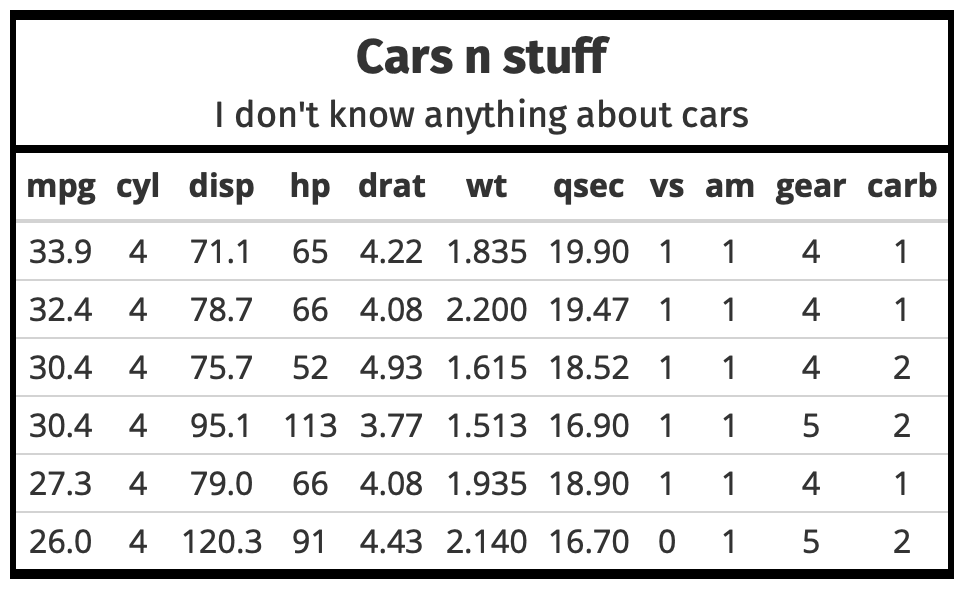

## DGThemes

Additional Themes and Theme Components for 'ggplot2'

----

```{r setup, include = F}
knitr::opts_chunk$set(warning = F, message = F, error = F)
```


This is a personal package for themes and theme components for ggplot2, gt, and other tools as I discover and use them throughout R.

The core theme: `theme_premium` uses Tisa Sans Pro which will need to be installed on just about any system, and can be downloaded [here](https://fontshub.pro/font/ff-tisa-sans-pro-download) or from this [github](https://github.com/ofnlut/IronGrads/tree/master/grads/static/fonts/Tisa-typeface/Tisa%20Sans%20Pro). This font is condensed, has solid default kerning pairs and geometric numbers. That's what I consider the "font trifecta" must-have for charts. A common prerequisite for charts for fonts is that they have a diversity of weights. Tisa Sans Pro has a wealth of diversity in its weights, as well as a pristine quality to its base font.

The following functions for ggplot2 are implemented/objects are exported:

Themes:

- `theme_duncan`: Open Sans, Fira Sans
- `theme_premium`: Tisa Sans Pro
- `theme_premium_gs`:  Goldman Sans Condensed
- `theme_premium_es`:  Econ Sans Condensed
- `theme_premium_rc`:  Roboto Condensed
- `theme_premium_ps`:  IBM Plex Sans font
- `theme_premium_pub`:  Public Sans
- `theme_premium_tw`:  Titilium Web
- `theme_modern_rc`: Roboto Condensed dark theme
- `theme_ft_rc`: Dark theme based on FT's dark theme (Roboto Condensed)

Scales (that align with various themes):

- `scale_color_premium`: Discrete color & fill scales based on the premium palette
- `scale_colour_premium`:  Discrete color & fill scales based on the premium palette
- `scale_fill_premium`:  Discrete color & fill scales based on the premium palette
- `scale_color_ft`:  Discrete color & fill scales based on the FT palette
- `scale_colour_ft`: Discrete color & fill scales based on the FT palette
- `scale_fill_ft`: Discrete color & fill scales based on the FT palette
- `scale_x_comma`: X & Y scales with opinionated presets for percent & comma label formats
- `scale_x_percent`: X & Y scales with opinionated presets for percent & comma label formats
- `scale_y_comma`: X & Y scales with opinionated presets for percent & comma label formats
- `scale_y_percent`: X & Y scales with opinionated presets for percent & comma label formats

Palettes/Named Colors:

- `premium_pal`: A muted, qualitative color palette
- `ft_cols`: FT color palette
- `ft_pal`:  A bright qualitative color palette
- `ft_text_col`: FT color palette

Fonts:

- `font_tn`: Tisa Sans Pro font name R variable aliases
- `font_es`:	Econ Sans font name R variable aliases
- `font_es_bold`:	Econ Sans font name R variable aliases
- `font_es_light`:	Econ Sans font name R variable aliases
- `font_fs`: Fira Sans font name R variable aliases
- `font_rc`: Roboto Condensed font name R variable aliases
- `font_rc_light`: Roboto Condensed font name R variable aliases
- `font_pub`:	Public Sans font name R variable aliases
- `font_pub_bold`:	Public Sans font name R variable aliases
- `font_pub_light`:	Public Sans font name R variable aliases
- `font_pub_thin`:	Public Sans font name R variable aliases
- `font_os`: Open Sans font name R variable aliases
- `font_ps`: PlexSans font name R variable aliases
- `font_ps_light`: PlexSans font name R variable aliases
- `font_tw`: Titillium Web font name R variable aliases
- `font_tw_bold`:  Titillium Web font name R variable aliases
- `font_tw_light`: Titillium Web font name R variable aliases

R Markdown:

- `premium`: premium R markdown template
- `premium_pdf`: premium R markdown template for PDF output

Utilities:

- `flush_ticks`: Makes axis text labels flush on the ends
- `ft_geom_defaults`:  Change geom defaults from black to custom lights for the FT theme
- `import_econ_sans`:  Import Econ Sans Condensed font for use in charts
- `import_plex_sans`:  Import IBM Plex Sans font for use in charts
- `import_roboto_condensed`: Import Roboto Condensed font for use in charts
- `import_titillium_web`:  Import Titillium Web font for use in charts
- `modern_geom_defaults`:  Change geom defaults from black to white for the modern theme
- `update_geom_font_defaults`: Update matching font defaults for text geoms

The following functions for gt are implemented/objects are exported:

- `gt_theme_duncan` - Makes a gt table with black outlines and bold title/column labels


### Installation

```{r eval = F}
# If this ever gets on the CRAN
# install.packages("DGThemes")
# devtools::install_github("dungates/DGThemes")
remotes::install_github("dungates/DGThemes")
```

NOTE: To use the ‘remotes’ install options you will need to have the [{remotes} package](https://github.com/r-lib/remotes) installed.

### Usage

```{r message=FALSE, warning=FALSE, error=FALSE}
library(DGThemes)
library(gcookbook)
library(tidyverse)

# current verison
packageVersion("DGThemes")
```

### Base theme (Tisa Sans Pro)

```{r gt_theme_1, message = F, warning = F, error = F, eval = F}
mtcars %>%
    dplyr::arrange(dplyr::desc(mpg)) %>%
    head() %>%
    gt::gt() %>%
    gt::tab_header(title = "Cars n stuff", subtitle = "I don't know anything about cars") %>%
    DGThemes::gt_theme_duncan()
```

{width = 50%}

```{r at}
ggplot(tophitters2001, aes(hr, so)) +
  geom_point() +
  labs(x="Home Runs", y="Strikeouts",
       title="Seminal ggplot2 scatterplot example",
       subtitle="Home runs come at the cost of strikeouts",
       caption="Data from the `tophitters2001` default set") + 
  geom_text(aes(label = if_else(hr > 50, name, NULL)),
            vjust = 1.2) +
  theme_premium()
```

### Roboto Condensed

```{r rc}
ggplot(beaver1, aes(time, temp)) +
  geom_line() +
  labs(x="Time (hm)", y="Temperature (celsius)",
       title="Beaver Temperature over Time",
       subtitle="Beavers activity peaks at night, around 10 o'clock.",
       caption="Data from the `beaver1` default set") + 
  theme_premium_rc()
```

### New FT Theme!

```{r ft}
Seatbelts <- as_tibble(Seatbelts)
ggplot(Seatbelts, aes(DriversKilled, kms)) +
  geom_point(aes(color = factor(law))) +
  labs(x="Number of Drivers Killed", y="Distance Driven (kms)",
       title="Always wear a seatbelt!",
       subtitle="Deaths fall dramatically when there are laws in place that require seatbelts.",
       color = "Seatbelt\nRequirement",
       caption="Data from the `Seatbelts` default set") + 
  coord_flip() +
  scale_color_ft(labels = c("Not Mandatory", "Mandatory")) +
  theme_ft_rc()
```

### IBM Plex Sans

```{r ps, fig.width=10, fig.height=7}
HairEyeColor <- as_tibble(HairEyeColor)
ggplot(HairEyeColor) +
  geom_boxplot(aes(x = Eye, y = n, color = Sex)) +
  scale_color_premium() +
  scale_fill_premium() +
  facet_wrap(~Sex) +
  labs(
    title="Eye Color in Males & Females",
    subtitle="The distribution of eye color appears to be the exact same between males and females",
    caption="Source: DGThemes & `HairEyeColor` default set"
  ) +
  theme_premium_ps(grid="XY", axis="xy") +
  theme(legend.position="bottom") -> gg

gg
```

### Titillium Web

```{r tw, fig.width=10, fig.height=7}
ggplot(diamonds, aes(carat, price)) +
  geom_jitter(aes(color=clarity, fill=clarity), size=3, shape=21, alpha=1/2) +
  scale_y_continuous(labels = scales::comma) +
  scale_color_premium() +
  scale_fill_premium() +
  facet_wrap(~clarity) +
  labs(
    title="Titillium Web",
    subtitle="This is a subtitle to see the how it looks in Titillium Web",
    caption="Source: DGThemes & `Diamonds` default set"
  ) +
  theme_premium_tw(grid="XY", axis="xy") +
  theme(legend.position="bottom")
```

### Scales (Color/Fill)

```{r sc}
ggplot(tophitters2001, aes(hr, so, color = lg)) +
  geom_point() +
  labs(x="Home Runs", y="Strikeouts",
       title="Seminal ggplot2 scatterplot example",
       subtitle="Home runs come at the cost of strikeouts",
       caption="Data from the `tophitters2001` default set") + 
  geom_text(aes(label = if_else(hr > 50, name, NULL)),
            vjust = 1.2) +
  scale_color_premium() +
  theme_premium() +
  theme(legend.position = "top")
```

### Scales (Axis)

```{r ax1}
tophitters2001 %>%
  mutate(count = sum(hr)) %>%
  dplyr::select(name, hr, count) %>%
  dplyr::summarise(pct = 100*hr/sum(hr),
                   name = name,
                   hr = hr) %>%
  dplyr::arrange(desc(pct)) %>%
  slice(c(1:10)) %>%
  ggplot(aes(fct_reorder(name, pct), pct)) +
  geom_col() +
  geom_text(aes(label = paste0(hr,"\n(",round(pct, 2),"%)")), vjust = -0.8, color = "black") +
  scale_y_percent(scale = 1, limits = c(0, 3)) +
  labs(x="Player", y="Percent of home runs in season",
       title="Barry Bonds ",
       subtitle="And here's another hit, Barry Bonds",
       caption="Data from the `mtcars` default set") + 
  theme_premium(grid="Y")
```

```{r ax2, fig.height=6}
ggplot(uspopage, aes(x=Year, y=Thousands, fill=AgeGroup)) + 
  geom_area() +
  scale_fill_premium() +
  scale_x_continuous(expand=c(0,0)) +
  scale_y_comma() +
  labs(title="Age distribution of population in the U.S., 1900-2002",
       subtitle="Example data from the R Graphics Cookbook",
       caption="Source: R Graphics Cookbook") +
  theme_premium_rc(grid="XY") +
  theme(axis.text.x=element_text(hjust=c(0, 0.5, 0.5, 0.5, 1))) +
  theme(legend.position="bottom")
```

```{r ax3}
update_geom_font_defaults(font_rc_light)

count(mpg, class) %>% 
  mutate(n=n*2000) %>% 
  arrange(n) %>% 
  mutate(class=factor(class, levels=class)) %>% 
  ggplot(aes(class, n)) +
  geom_col() +
  geom_text(aes(label=scales::comma(n)), hjust=0, nudge_y=2000) +
  scale_y_comma(limits=c(0,150000)) +
  coord_flip() +
  labs(x="Fuel efficiency (mpg)", y="Weight (tons)",
       title="Seminal ggplot2 column chart example with commas",
       subtitle="A plot that is only useful for demonstration purposes, esp since you'd never\nreally want direct labels and axis labels",
       caption="Brought to you by the letter 'g'") + 
  theme_premium_rc(grid="X")
```

### Spellcheck ggplot2 labels from `hrbrthemes`

```{r sp, message=TRUE}
df <- data.frame(x=c(20, 25, 30), y=c(4, 4, 4), txt=c("One", "Two", "Three"))

ggplot(mtcars, aes(mpg, wt)) +
  geom_point() +
  labs(x="This is some txt", y="This is more text",
       title="Thisy is a titlle",
       subtitle="This is a subtitley",
       caption="This is a captien") +
  theme_premium_rc(grid="XY") -> gg

hrbrthemes::gg_check(gg)
```

### DGThemes Metrics

```{r cloc, echo=FALSE, message=FALSE, warning=FALSE, error=FALSE}
cloc::cloc_pkg_md()
```
