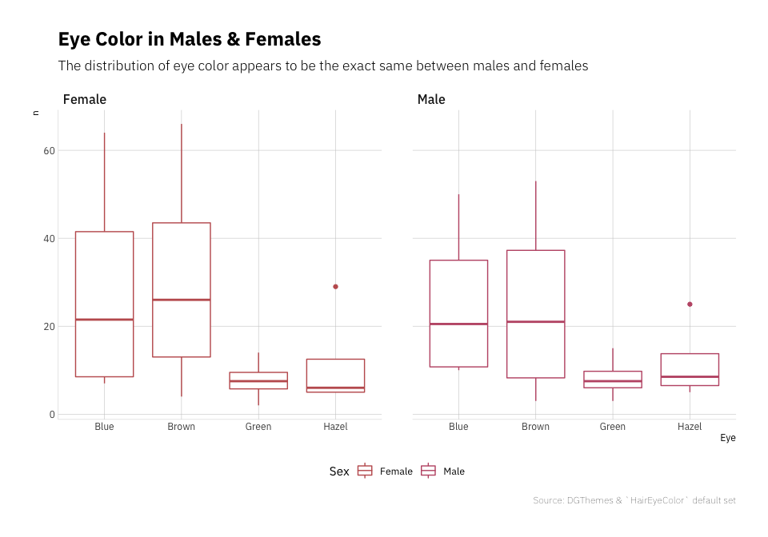
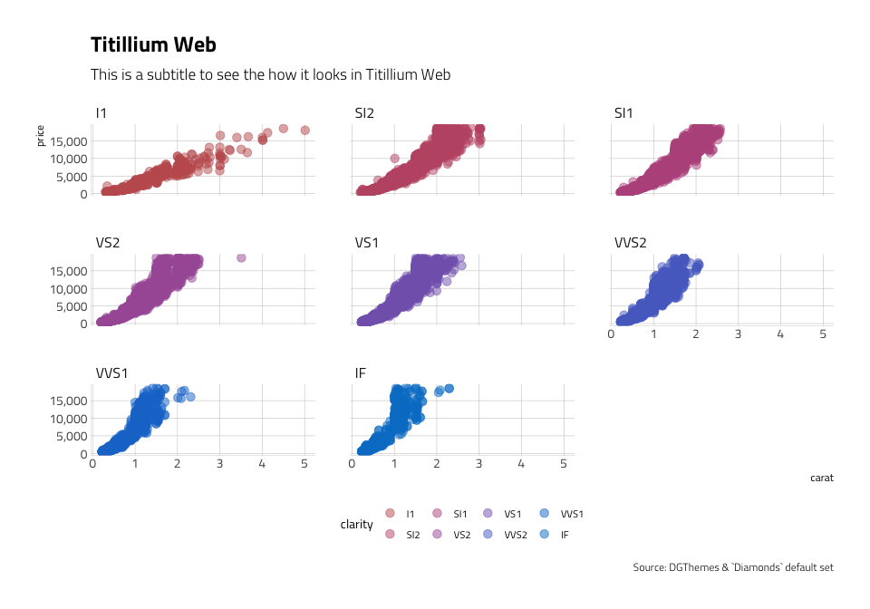
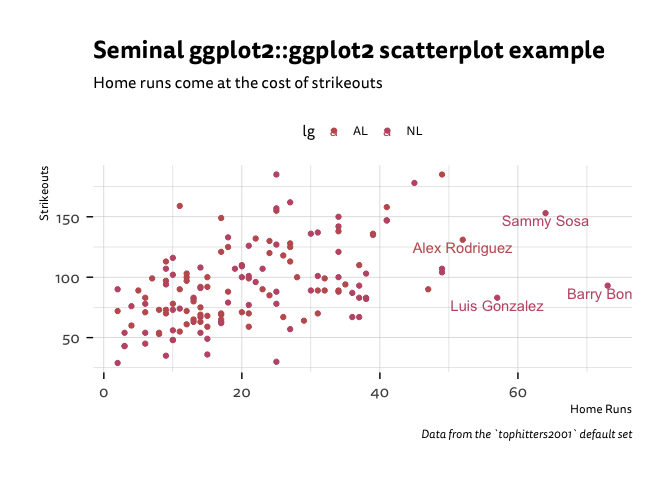
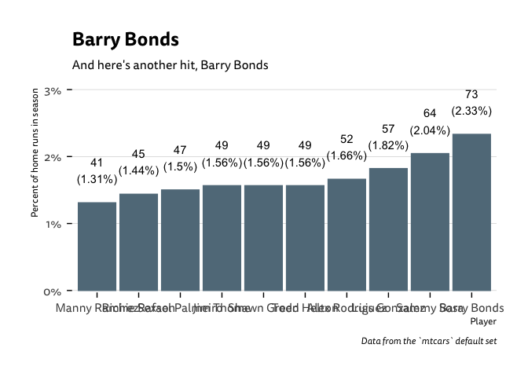
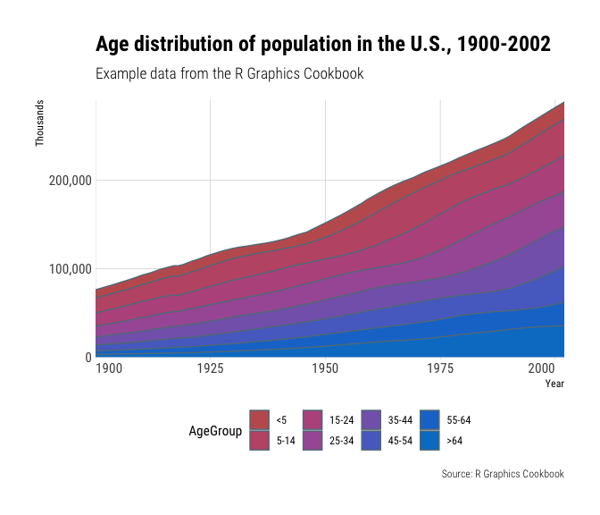

## DGThemes

Additional Themes and Theme Components for ‘ggplot2’

------------------------------------------------------------------------

This is a personal package for themes and theme components for ggplot2,
gt, and other tools as I discover and use them throughout R.

The core theme: `theme_premium` uses Tisa Sans Pro which will need to be
installed on just about any system, and can be downloaded
[here](https://fontshub.pro/font/ff-tisa-sans-pro-download) or from this
[github](https://github.com/ofnlut/IronGrads/tree/master/grads/static/fonts/Tisa-typeface/Tisa%20Sans%20Pro).
This font is condensed, has solid default kerning pairs and geometric
numbers. That’s what I consider the “font trifecta” must-have for
charts. A common prerequisite for charts for fonts is that they have a
diversity of weights. Tisa Sans Pro has a wealth of diversity in its
weights, as well as a pristine quality to its base font.

The following functions for ggplot2 are implemented/objects are
exported:

Themes:

-   `theme_duncan`: Open Sans, Fira Sans
-   `theme_premium`: Tisa Sans Pro
-   `theme_premium_gs`: Goldman Sans Condensed
-   `theme_premium_es`: Econ Sans Condensed
-   `theme_premium_rc`: Roboto Condensed
-   `theme_premium_ps`: IBM Plex Sans font
-   `theme_premium_pub`: Public Sans
-   `theme_premium_tw`: Titilium Web
-   `theme_modern_rc`: Roboto Condensed dark theme
-   `theme_ft_rc`: Dark theme based on FT’s dark theme (Roboto
    Condensed)

Scales (that align with various themes):

-   `scale_color_premium`: Discrete color & fill scales based on the
    premium palette
-   `scale_colour_premium`: Discrete color & fill scales based on the
    premium palette
-   `scale_fill_premium`: Discrete color & fill scales based on the
    premium palette
-   `scale_color_ft`: Discrete color & fill scales based on the FT
    palette
-   `scale_colour_ft`: Discrete color & fill scales based on the FT
    palette
-   `scale_fill_ft`: Discrete color & fill scales based on the FT
    palette
-   `scale_x_comma`: X & Y scales with opinionated presets for percent &
    comma label formats
-   `scale_x_percent`: X & Y scales with opinionated presets for percent
    & comma label formats
-   `scale_y_comma`: X & Y scales with opinionated presets for percent &
    comma label formats
-   `scale_y_percent`: X & Y scales with opinionated presets for percent
    & comma label formats

Palettes/Named Colors:

-   `premium_pal`: A muted, qualitative color palette
-   `ft_cols`: FT color palette
-   `ft_pal`: A bright qualitative color palette
-   `ft_text_col`: FT color palette

Fonts:

-   `font_tn`: Tisa Sans Pro font name R variable aliases
-   `font_es`: Econ Sans font name R variable aliases
-   `font_es_bold`: Econ Sans font name R variable aliases
-   `font_es_light`: Econ Sans font name R variable aliases
-   `font_fs`: Fira Sans font name R variable aliases
-   `font_rc`: Roboto Condensed font name R variable aliases
-   `font_rc_light`: Roboto Condensed font name R variable aliases
-   `font_pub`: Public Sans font name R variable aliases
-   `font_pub_bold`: Public Sans font name R variable aliases
-   `font_pub_light`: Public Sans font name R variable aliases
-   `font_pub_thin`: Public Sans font name R variable aliases
-   `font_os`: Open Sans font name R variable aliases
-   `font_ps`: PlexSans font name R variable aliases
-   `font_ps_light`: PlexSans font name R variable aliases
-   `font_tw`: Titillium Web font name R variable aliases
-   `font_tw_bold`: Titillium Web font name R variable aliases
-   `font_tw_light`: Titillium Web font name R variable aliases

R Markdown:

-   `premium`: premium R markdown template
-   `premium_pdf`: premium R markdown template for PDF output

Utilities:

-   `flush_ticks`: Makes axis text labels flush on the ends
-   `ft_geom_defaults`: Change geom defaults from black to custom lights
    for the FT theme
-   `import_econ_sans`: Import Econ Sans Condensed font for use in
    charts
-   `import_plex_sans`: Import IBM Plex Sans font for use in charts
-   `import_roboto_condensed`: Import Roboto Condensed font for use in
    charts
-   `import_titillium_web`: Import Titillium Web font for use in charts
-   `modern_geom_defaults`: Change geom defaults from black to white for
    the modern theme
-   `update_geom_font_defaults`: Update matching font defaults for text
    geoms

The following functions for gt are implemented/objects are exported:

-   `gt_theme_duncan` - Makes a gt table with black outlines and bold
    title/column labels

``` r
library(tidyverse)
mtcars %>%
    arrange(desc(mpg)) %>%
    head() %>%
    gt::gt() %>%
    gt::tab_header(title = "Cars n stuff", subtitle = "I don't know anything about cars") %>%
    DGThemes::gt_theme_duncan()
```

<div id="njlzdoeuyk" style="overflow-x:auto;overflow-y:auto;width:auto;height:auto;">
<style>@import url("https://fonts.googleapis.com/css2?family=Open+Sans:ital,wght@0,100;0,200;0,300;0,400;0,500;0,600;0,700;0,800;0,900;1,100;1,200;1,300;1,400;1,500;1,600;1,700;1,800;1,900&display=swap");
html {
  font-family: 'Open Sans', -apple-system, BlinkMacSystemFont, 'Segoe UI', Roboto, Oxygen, Ubuntu, Cantarell, 'Helvetica Neue', 'Fira Sans', 'Droid Sans', Arial, sans-serif;
}

#njlzdoeuyk .gt_table {
  display: table;
  border-collapse: collapse;
  margin-left: auto;
  margin-right: auto;
  color: #333333;
  font-size: 16px;
  font-weight: normal;
  font-style: normal;
  background-color: #FFFFFF;
  width: auto;
  border-top-style: solid;
  border-top-width: 5px;
  border-top-color: black;
  border-right-style: solid;
  border-right-width: 3px;
  border-right-color: black;
  border-bottom-style: solid;
  border-bottom-width: 5px;
  border-bottom-color: black;
  border-left-style: solid;
  border-left-width: 3px;
  border-left-color: black;
}

#njlzdoeuyk .gt_heading {
  background-color: #FFFFFF;
  text-align: center;
  border-bottom-color: #FFFFFF;
  border-left-style: none;
  border-left-width: 1px;
  border-left-color: #D3D3D3;
  border-right-style: none;
  border-right-width: 1px;
  border-right-color: #D3D3D3;
}

#njlzdoeuyk .gt_title {
  color: #333333;
  font-size: 125%;
  font-weight: initial;
  padding-top: 4px;
  padding-bottom: 4px;
  border-bottom-color: #FFFFFF;
  border-bottom-width: 0;
}

#njlzdoeuyk .gt_subtitle {
  color: #333333;
  font-size: 85%;
  font-weight: initial;
  padding-top: 0;
  padding-bottom: 4px;
  border-top-color: #FFFFFF;
  border-top-width: 0;
}

#njlzdoeuyk .gt_bottom_border {
  border-bottom-style: solid;
  border-bottom-width: 2px;
  border-bottom-color: #D3D3D3;
}

#njlzdoeuyk .gt_col_headings {
  border-top-style: solid;
  border-top-width: 4px;
  border-top-color: black;
  border-bottom-style: solid;
  border-bottom-width: 2px;
  border-bottom-color: #D3D3D3;
  border-left-style: none;
  border-left-width: 1px;
  border-left-color: #D3D3D3;
  border-right-style: none;
  border-right-width: 1px;
  border-right-color: #D3D3D3;
}

#njlzdoeuyk .gt_col_heading {
  color: #333333;
  background-color: #FFFFFF;
  font-size: 100%;
  font-weight: bold;
  text-transform: inherit;
  border-left-style: none;
  border-left-width: 1px;
  border-left-color: #D3D3D3;
  border-right-style: none;
  border-right-width: 1px;
  border-right-color: #D3D3D3;
  vertical-align: bottom;
  padding-top: 5px;
  padding-bottom: 6px;
  padding-left: 5px;
  padding-right: 5px;
  overflow-x: hidden;
}

#njlzdoeuyk .gt_column_spanner_outer {
  color: #333333;
  background-color: #FFFFFF;
  font-size: 100%;
  font-weight: bold;
  text-transform: inherit;
  padding-top: 0;
  padding-bottom: 0;
  padding-left: 4px;
  padding-right: 4px;
}

#njlzdoeuyk .gt_column_spanner_outer:first-child {
  padding-left: 0;
}

#njlzdoeuyk .gt_column_spanner_outer:last-child {
  padding-right: 0;
}

#njlzdoeuyk .gt_column_spanner {
  border-bottom-style: solid;
  border-bottom-width: 2px;
  border-bottom-color: #D3D3D3;
  vertical-align: bottom;
  padding-top: 5px;
  padding-bottom: 6px;
  overflow-x: hidden;
  display: inline-block;
  width: 100%;
}

#njlzdoeuyk .gt_group_heading {
  padding: 8px;
  color: #333333;
  background-color: #FFFFFF;
  font-size: 100%;
  font-weight: initial;
  text-transform: inherit;
  border-top-style: solid;
  border-top-width: 2px;
  border-top-color: #D3D3D3;
  border-bottom-style: solid;
  border-bottom-width: 2px;
  border-bottom-color: #D3D3D3;
  border-left-style: none;
  border-left-width: 1px;
  border-left-color: #D3D3D3;
  border-right-style: none;
  border-right-width: 1px;
  border-right-color: #D3D3D3;
  vertical-align: middle;
}

#njlzdoeuyk .gt_empty_group_heading {
  padding: 0.5px;
  color: #333333;
  background-color: #FFFFFF;
  font-size: 100%;
  font-weight: initial;
  border-top-style: solid;
  border-top-width: 2px;
  border-top-color: #D3D3D3;
  border-bottom-style: solid;
  border-bottom-width: 2px;
  border-bottom-color: #D3D3D3;
  vertical-align: middle;
}

#njlzdoeuyk .gt_from_md > :first-child {
  margin-top: 0;
}

#njlzdoeuyk .gt_from_md > :last-child {
  margin-bottom: 0;
}

#njlzdoeuyk .gt_row {
  padding-top: 3px;
  padding-bottom: 3px;
  padding-left: 5px;
  padding-right: 5px;
  margin: 10px;
  border-top-style: solid;
  border-top-width: 1px;
  border-top-color: #D3D3D3;
  border-left-style: none;
  border-left-width: 1px;
  border-left-color: #D3D3D3;
  border-right-style: none;
  border-right-width: 1px;
  border-right-color: #D3D3D3;
  vertical-align: middle;
  overflow-x: hidden;
}

#njlzdoeuyk .gt_stub {
  color: #333333;
  background-color: #FFFFFF;
  font-size: 100%;
  font-weight: initial;
  text-transform: inherit;
  border-right-style: solid;
  border-right-width: 2px;
  border-right-color: #D3D3D3;
  padding-left: 12px;
}

#njlzdoeuyk .gt_summary_row {
  color: #333333;
  background-color: #FFFFFF;
  text-transform: inherit;
  padding-top: 8px;
  padding-bottom: 8px;
  padding-left: 5px;
  padding-right: 5px;
}

#njlzdoeuyk .gt_first_summary_row {
  padding-top: 8px;
  padding-bottom: 8px;
  padding-left: 5px;
  padding-right: 5px;
  border-top-style: solid;
  border-top-width: 2px;
  border-top-color: #D3D3D3;
}

#njlzdoeuyk .gt_grand_summary_row {
  color: #333333;
  background-color: #FFFFFF;
  text-transform: inherit;
  padding-top: 8px;
  padding-bottom: 8px;
  padding-left: 5px;
  padding-right: 5px;
}

#njlzdoeuyk .gt_first_grand_summary_row {
  padding-top: 8px;
  padding-bottom: 8px;
  padding-left: 5px;
  padding-right: 5px;
  border-top-style: double;
  border-top-width: 6px;
  border-top-color: #D3D3D3;
}

#njlzdoeuyk .gt_striped {
  background-color: rgba(128, 128, 128, 0.05);
}

#njlzdoeuyk .gt_table_body {
  border-top-style: solid;
  border-top-width: 2px;
  border-top-color: #D3D3D3;
  border-bottom-style: solid;
  border-bottom-width: 2px;
  border-bottom-color: #D3D3D3;
}

#njlzdoeuyk .gt_footnotes {
  color: #333333;
  background-color: #FFFFFF;
  border-bottom-style: none;
  border-bottom-width: 2px;
  border-bottom-color: #D3D3D3;
  border-left-style: none;
  border-left-width: 2px;
  border-left-color: #D3D3D3;
  border-right-style: none;
  border-right-width: 2px;
  border-right-color: #D3D3D3;
}

#njlzdoeuyk .gt_footnote {
  margin: 0px;
  font-size: 90%;
  padding: 4px;
}

#njlzdoeuyk .gt_sourcenotes {
  color: #333333;
  background-color: #FFFFFF;
  border-bottom-style: none;
  border-bottom-width: 2px;
  border-bottom-color: #D3D3D3;
  border-left-style: none;
  border-left-width: 0px;
  border-left-color: #D3D3D3;
  border-right-style: none;
  border-right-width: 0px;
  border-right-color: #D3D3D3;
}

#njlzdoeuyk .gt_sourcenote {
  font-size: 12px;
  padding: 10px;
}

#njlzdoeuyk .gt_left {
  text-align: left;
}

#njlzdoeuyk .gt_center {
  text-align: center;
}

#njlzdoeuyk .gt_right {
  text-align: right;
  font-variant-numeric: tabular-nums;
}

#njlzdoeuyk .gt_font_normal {
  font-weight: normal;
}

#njlzdoeuyk .gt_font_bold {
  font-weight: bold;
}

#njlzdoeuyk .gt_font_italic {
  font-style: italic;
}

#njlzdoeuyk .gt_super {
  font-size: 65%;
}

#njlzdoeuyk .gt_footnote_marks {
  font-style: italic;
  font-weight: normal;
  font-size: 65%;
}
</style>
<table class="gt_table">
  <thead class="gt_header">
    <tr>
      <th colspan="11" class="gt_heading gt_title gt_font_normal" style="font-family: Fira Sans; font-size: x-large; text-align: center; font-weight: bold;">Cars n stuff</th>
    </tr>
    <tr>
      <th colspan="11" class="gt_heading gt_subtitle gt_font_normal gt_bottom_border" style="font-family: Fira Sans; font-size: large; text-align: center; font-weight: lighter;">I don't know anything about cars</th>
    </tr>
  </thead>
  <thead class="gt_col_headings">
    <tr>
      <th class="gt_col_heading gt_columns_bottom_border gt_center" rowspan="1" colspan="1">mpg</th>
      <th class="gt_col_heading gt_columns_bottom_border gt_center" rowspan="1" colspan="1">cyl</th>
      <th class="gt_col_heading gt_columns_bottom_border gt_center" rowspan="1" colspan="1">disp</th>
      <th class="gt_col_heading gt_columns_bottom_border gt_center" rowspan="1" colspan="1">hp</th>
      <th class="gt_col_heading gt_columns_bottom_border gt_center" rowspan="1" colspan="1">drat</th>
      <th class="gt_col_heading gt_columns_bottom_border gt_center" rowspan="1" colspan="1">wt</th>
      <th class="gt_col_heading gt_columns_bottom_border gt_center" rowspan="1" colspan="1">qsec</th>
      <th class="gt_col_heading gt_columns_bottom_border gt_center" rowspan="1" colspan="1">vs</th>
      <th class="gt_col_heading gt_columns_bottom_border gt_center" rowspan="1" colspan="1">am</th>
      <th class="gt_col_heading gt_columns_bottom_border gt_center" rowspan="1" colspan="1">gear</th>
      <th class="gt_col_heading gt_columns_bottom_border gt_center" rowspan="1" colspan="1">carb</th>
    </tr>
  </thead>
  <tbody class="gt_table_body">
    <tr><td class="gt_row gt_center" style="font-size: medium; text-align: center;">33.9</td>
<td class="gt_row gt_center" style="font-size: medium; text-align: center;">4</td>
<td class="gt_row gt_center" style="font-size: medium; text-align: center;">71.1</td>
<td class="gt_row gt_center" style="font-size: medium; text-align: center;">65</td>
<td class="gt_row gt_center" style="font-size: medium; text-align: center;">4.22</td>
<td class="gt_row gt_center" style="font-size: medium; text-align: center;">1.835</td>
<td class="gt_row gt_center" style="font-size: medium; text-align: center;">19.90</td>
<td class="gt_row gt_center" style="font-size: medium; text-align: center;">1</td>
<td class="gt_row gt_center" style="font-size: medium; text-align: center;">1</td>
<td class="gt_row gt_center" style="font-size: medium; text-align: center;">4</td>
<td class="gt_row gt_center" style="font-size: medium; text-align: center;">1</td></tr>
    <tr><td class="gt_row gt_center" style="font-size: medium; text-align: center;">32.4</td>
<td class="gt_row gt_center" style="font-size: medium; text-align: center;">4</td>
<td class="gt_row gt_center" style="font-size: medium; text-align: center;">78.7</td>
<td class="gt_row gt_center" style="font-size: medium; text-align: center;">66</td>
<td class="gt_row gt_center" style="font-size: medium; text-align: center;">4.08</td>
<td class="gt_row gt_center" style="font-size: medium; text-align: center;">2.200</td>
<td class="gt_row gt_center" style="font-size: medium; text-align: center;">19.47</td>
<td class="gt_row gt_center" style="font-size: medium; text-align: center;">1</td>
<td class="gt_row gt_center" style="font-size: medium; text-align: center;">1</td>
<td class="gt_row gt_center" style="font-size: medium; text-align: center;">4</td>
<td class="gt_row gt_center" style="font-size: medium; text-align: center;">1</td></tr>
    <tr><td class="gt_row gt_center" style="font-size: medium; text-align: center;">30.4</td>
<td class="gt_row gt_center" style="font-size: medium; text-align: center;">4</td>
<td class="gt_row gt_center" style="font-size: medium; text-align: center;">75.7</td>
<td class="gt_row gt_center" style="font-size: medium; text-align: center;">52</td>
<td class="gt_row gt_center" style="font-size: medium; text-align: center;">4.93</td>
<td class="gt_row gt_center" style="font-size: medium; text-align: center;">1.615</td>
<td class="gt_row gt_center" style="font-size: medium; text-align: center;">18.52</td>
<td class="gt_row gt_center" style="font-size: medium; text-align: center;">1</td>
<td class="gt_row gt_center" style="font-size: medium; text-align: center;">1</td>
<td class="gt_row gt_center" style="font-size: medium; text-align: center;">4</td>
<td class="gt_row gt_center" style="font-size: medium; text-align: center;">2</td></tr>
    <tr><td class="gt_row gt_center" style="font-size: medium; text-align: center;">30.4</td>
<td class="gt_row gt_center" style="font-size: medium; text-align: center;">4</td>
<td class="gt_row gt_center" style="font-size: medium; text-align: center;">95.1</td>
<td class="gt_row gt_center" style="font-size: medium; text-align: center;">113</td>
<td class="gt_row gt_center" style="font-size: medium; text-align: center;">3.77</td>
<td class="gt_row gt_center" style="font-size: medium; text-align: center;">1.513</td>
<td class="gt_row gt_center" style="font-size: medium; text-align: center;">16.90</td>
<td class="gt_row gt_center" style="font-size: medium; text-align: center;">1</td>
<td class="gt_row gt_center" style="font-size: medium; text-align: center;">1</td>
<td class="gt_row gt_center" style="font-size: medium; text-align: center;">5</td>
<td class="gt_row gt_center" style="font-size: medium; text-align: center;">2</td></tr>
    <tr><td class="gt_row gt_center" style="font-size: medium; text-align: center;">27.3</td>
<td class="gt_row gt_center" style="font-size: medium; text-align: center;">4</td>
<td class="gt_row gt_center" style="font-size: medium; text-align: center;">79.0</td>
<td class="gt_row gt_center" style="font-size: medium; text-align: center;">66</td>
<td class="gt_row gt_center" style="font-size: medium; text-align: center;">4.08</td>
<td class="gt_row gt_center" style="font-size: medium; text-align: center;">1.935</td>
<td class="gt_row gt_center" style="font-size: medium; text-align: center;">18.90</td>
<td class="gt_row gt_center" style="font-size: medium; text-align: center;">1</td>
<td class="gt_row gt_center" style="font-size: medium; text-align: center;">1</td>
<td class="gt_row gt_center" style="font-size: medium; text-align: center;">4</td>
<td class="gt_row gt_center" style="font-size: medium; text-align: center;">1</td></tr>
    <tr><td class="gt_row gt_center" style="font-size: medium; text-align: center;">26.0</td>
<td class="gt_row gt_center" style="font-size: medium; text-align: center;">4</td>
<td class="gt_row gt_center" style="font-size: medium; text-align: center;">120.3</td>
<td class="gt_row gt_center" style="font-size: medium; text-align: center;">91</td>
<td class="gt_row gt_center" style="font-size: medium; text-align: center;">4.43</td>
<td class="gt_row gt_center" style="font-size: medium; text-align: center;">2.140</td>
<td class="gt_row gt_center" style="font-size: medium; text-align: center;">16.70</td>
<td class="gt_row gt_center" style="font-size: medium; text-align: center;">0</td>
<td class="gt_row gt_center" style="font-size: medium; text-align: center;">1</td>
<td class="gt_row gt_center" style="font-size: medium; text-align: center;">5</td>
<td class="gt_row gt_center" style="font-size: medium; text-align: center;">2</td></tr>
  </tbody>
  
  
</table>
</div>

### Installation

``` r
# If this ever gets on the CRAN
# install.packages("DGThemes")
# devtools::install_github("dungates/DGThemes")
remotes::install_github("dungates/DGThemes")
```

    ## Downloading GitHub repo dungates/DGThemes@HEAD

    ## 
    ##      checking for file ‘/private/var/folders/ld/xmm5dtcj17gf5p6yhc56t0mm0000gn/T/RtmpsYtj92/remotes1752cb7b971c/dungates-DGThemes-7c86e2f/DESCRIPTION’ ...  ✓  checking for file ‘/private/var/folders/ld/xmm5dtcj17gf5p6yhc56t0mm0000gn/T/RtmpsYtj92/remotes1752cb7b971c/dungates-DGThemes-7c86e2f/DESCRIPTION’
    ##   ─  preparing ‘DGThemes’:
    ##      checking DESCRIPTION meta-information ...  ✓  checking DESCRIPTION meta-information
    ##   ─  checking for LF line-endings in source and make files and shell scripts
    ##   ─  checking for empty or unneeded directories
    ##   ─  building ‘DGThemes_0.8.6.tar.gz’
    ##      
    ## 

NOTE: To use the ‘remotes’ install options you will need to have the
[{remotes} package](https://github.com/r-lib/remotes) installed.

### Usage

``` r
library(DGThemes)
library(gcookbook)
library(tidyverse)

# current verison
packageVersion("DGThemes")
```

    ## [1] '0.8.6'

### Base theme (Tisa Sans Pro)

``` r
ggplot(tophitters2001, aes(hr, so)) +
  geom_point() +
  labs(x="Home Runs", y="Strikeouts",
       title="Seminal ggplot2 scatterplot example",
       subtitle="Home runs come at the cost of strikeouts",
       caption="Data from the `tophitters2001` default set") + 
  geom_text(aes(label = if_else(hr > 50, name, NULL)),
            vjust = 1.2) +
  theme_premium()
```

    ## Warning: Removed 140 rows containing missing values (geom_text).

<!-- -->

### Roboto Condensed

``` r
ggplot(beaver1, aes(time, temp)) +
  geom_line() +
  labs(x="Time (hm)", y="Temperature (celsius)",
       title="Beaver Temperature over Time",
       subtitle="Beavers activity peaks at night, around 10 o'clock.",
       caption="Data from the `beaver1` default set") + 
  theme_premium_rc()
```

<!-- -->

### New FT Theme!

``` r
Seatbelts <- as_tibble(Seatbelts)
ggplot(Seatbelts, aes(DriversKilled, kms)) +
  geom_point(aes(color = factor(law))) +
  labs(x="Number of Drivers Killed", y="Distance Driven (kms)",
       title="Always wear a seatbelt!",
       subtitle="Deaths fall dramatically when there are laws in place that require seatbelts.",
       color = "Seatbelt\nRequirement",
       caption="Data from the `Seatbelts` default set") + 
  coord_flip() +
  scale_color_ft(labels = c("Not Mandatory", "Mandatory")) +
  theme_ft_rc()
```

<!-- -->

### IBM Plex Sans

``` r
HairEyeColor <- as_tibble(HairEyeColor)
ggplot(HairEyeColor) +
  geom_boxplot(aes(x = Eye, y = n, color = Sex)) +
  scale_color_premium() +
  scale_fill_premium() +
  facet_wrap(~Sex) +
  labs(
    title="Eye Color in Males & Females",
    subtitle="The distribution of eye color appears to be the exact same between males and females",
    caption="Source: DGThemes & `HairEyeColor` default set"
  ) +
  theme_premium_ps(grid="XY", axis="xy") +
  theme(legend.position="bottom") -> gg

gg
```

<!-- -->

### Titillium Web

``` r
ggplot(diamonds, aes(carat, price)) +
  geom_jitter(aes(color=clarity, fill=clarity), size=3, shape=21, alpha=1/2) +
  scale_y_continuous(labels = scales::comma) +
  scale_color_premium() +
  scale_fill_premium() +
  facet_wrap(~clarity) +
  labs(
    title="Titillium Web",
    subtitle="This is a subtitle to see the how it looks in Titillium Web",
    caption="Source: DGThemes & `Diamonds` default set"
  ) +
  theme_premium_tw(grid="XY", axis="xy") +
  theme(legend.position="bottom")
```

<!-- -->

### Scales (Color/Fill)

``` r
ggplot(tophitters2001, aes(hr, so, color = lg)) +
  geom_point() +
  labs(x="Home Runs", y="Strikeouts",
       title="Seminal ggplot2 scatterplot example",
       subtitle="Home runs come at the cost of strikeouts",
       caption="Data from the `tophitters2001` default set") + 
  geom_text(aes(label = if_else(hr > 50, name, NULL)),
            vjust = 1.2) +
  scale_color_premium() +
  theme_premium() +
  theme(legend.position = "top")
```

    ## Warning: Removed 140 rows containing missing values (geom_text).

<!-- -->

### Scales (Axis)

``` r
tophitters2001 %>%
  mutate(count = sum(hr)) %>%
  dplyr::select(name, hr, count) %>%
  dplyr::summarise(pct = 100*hr/sum(hr),
                   name = name,
                   hr = hr) %>%
  dplyr::arrange(desc(pct)) %>%
  slice(c(1:10)) %>%
  ggplot(aes(fct_reorder(name, pct), pct)) +
  geom_col() +
  geom_text(aes(label = paste0(hr,"\n(",round(pct, 2),"%)")), vjust = -0.8, color = "black") +
  scale_y_percent(scale = 1, limits = c(0, 3)) +
  labs(x="Player", y="Percent of home runs in season",
       title="Barry Bonds ",
       subtitle="And here's another hit, Barry Bonds",
       caption="Data from the `mtcars` default set") + 
  theme_premium(grid="Y")
```

<!-- -->

``` r
ggplot(uspopage, aes(x=Year, y=Thousands, fill=AgeGroup)) + 
  geom_area() +
  scale_fill_premium() +
  scale_x_continuous(expand=c(0,0)) +
  scale_y_comma() +
  labs(title="Age distribution of population in the U.S., 1900-2002",
       subtitle="Example data from the R Graphics Cookbook",
       caption="Source: R Graphics Cookbook") +
  theme_premium_rc(grid="XY") +
  theme(axis.text.x=element_text(hjust=c(0, 0.5, 0.5, 0.5, 1))) +
  theme(legend.position="bottom")
```

    ## Warning: Vectorized input to `element_text()` is not officially supported.
    ## Results may be unexpected or may change in future versions of ggplot2.

<!-- -->

``` r
update_geom_font_defaults(font_rc_light)

count(mpg, class) %>% 
  mutate(n=n*2000) %>% 
  arrange(n) %>% 
  mutate(class=factor(class, levels=class)) %>% 
  ggplot(aes(class, n)) +
  geom_col() +
  geom_text(aes(label=scales::comma(n)), hjust=0, nudge_y=2000) +
  scale_y_comma(limits=c(0,150000)) +
  coord_flip() +
  labs(x="Fuel efficiency (mpg)", y="Weight (tons)",
       title="Seminal ggplot2 column chart example with commas",
       subtitle="A plot that is only useful for demonstration purposes, esp since you'd never\nreally want direct labels and axis labels",
       caption="Brought to you by the letter 'g'") + 
  theme_premium_rc(grid="X")
```

<!-- -->

### Spellcheck ggplot2 labels from `hrbrthemes`

``` r
df <- data.frame(x=c(20, 25, 30), y=c(4, 4, 4), txt=c("One", "Two", "Three"))

ggplot(mtcars, aes(mpg, wt)) +
  geom_point() +
  labs(x="This is some txt", y="This is more text",
       title="Thisy is a titlle",
       subtitle="This is a subtitley",
       caption="This is a captien") +
  theme_premium_rc(grid="XY") -> gg

hrbrthemes::gg_check(gg)
```

    ## Possible misspelled words in [title]: (Thisy, titlle)

    ## Possible misspelled words in [subtitle]: (subtitley)

    ## Possible misspelled words in [caption]: (captien)

<!-- -->

### DGThemes Metrics

| Lang | \# Files |  (%) |  LoC |  (%) | Blank lines |  (%) | \# Lines |  (%) |
|:-----|---------:|-----:|-----:|-----:|------------:|-----:|---------:|-----:|
| R    |       26 | 0.41 | 1924 | 0.42 |         346 | 0.39 |     1170 | 0.44 |
| SVG  |        2 | 0.03 |  150 | 0.03 |           0 | 0.00 |        0 | 0.00 |
| Rmd  |        2 | 0.03 |  141 | 0.03 |          99 | 0.11 |      172 | 0.06 |
| YAML |        2 | 0.03 |   56 | 0.01 |           3 | 0.00 |        2 | 0.00 |
| SUM  |       32 | 0.50 | 2271 | 0.50 |         448 | 0.50 |     1344 | 0.50 |

clock Package Metrics for DGThemes
